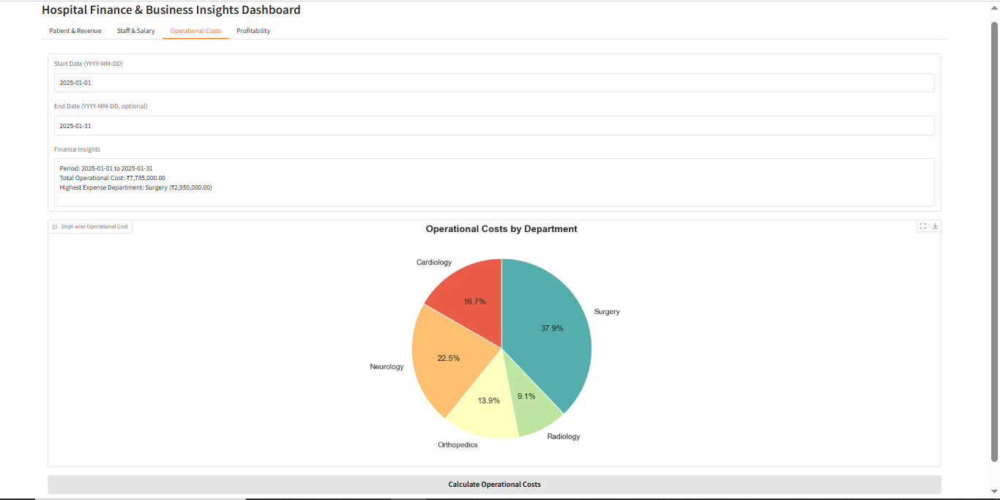
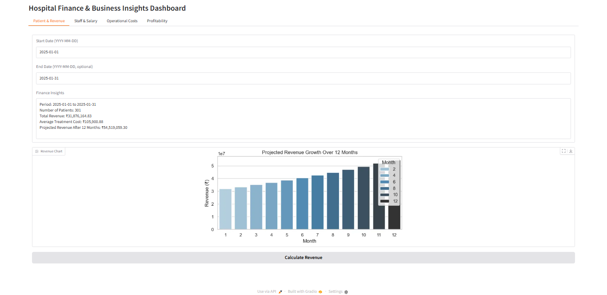
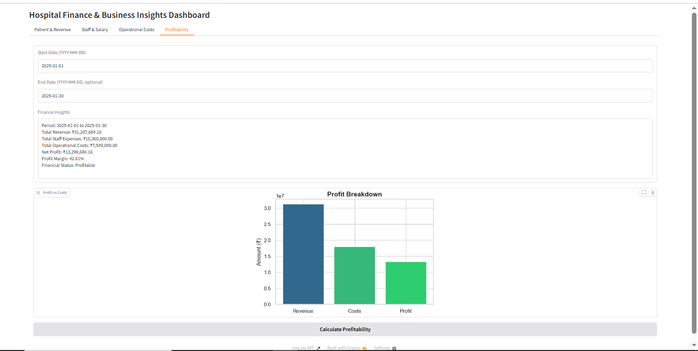

# Hospital_Financial_Insights-

##  Overview
Interactive Python interface to analyze hospital finances, predict treatment costs using Random Forest, and generate insights on revenue, staff salaries, operational costs, and profitability.

##  Dataset
- 2000 patient records with multiple departments & staff roles.
- Columns:
  - `patient_id`, `department`, `staff_id`, `staff_role`
  - `treatment_cost`, `staff_expenses`, `operational_costs`, `date`

##  Steps
1. Load and clean the dataset.
2. Feature engineering (`total_cost`, `staff_expense_ratio`).
3. Exploratory Data Analysis (cost distributions, department averages).
4. Train ML models:
   - Linear Regression 
   - Random Forest 
5. Build interactive **Gradio dashboard**:
   - Patient & Revenue
   - Staff & Salary
   - Operational Costs
   - Profitability
## Key Results
Random Forest gives near-perfect treatment cost predictions.(R² ≈ 0.999)
Dashboard provides visual insights for hospital financial decision-making.

### Sample Outputs

**Treatment Cost Distribution**  


**Revenue Growth Chart**  


**Staff Salary Chart**  


**Profitability Chart**  


##  How to Run
1. Clone the repo:
   ```bash
   git clone https://github.com/<MaansriJN>/Hospital_Financial_Insights-.git
